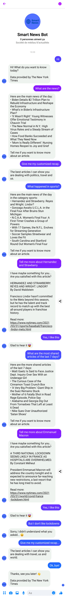

# Smart New York Times chatbot

[](https://opensource.org/licenses/MIT)

[](https://developer.nytimes.com/)

This chatbot has been developped by Anatole Lapelerie for a Chatbot and recommendation systems course at ESILV. It contains a Facebook Messenger chatbot side using The New York Times APIs and a recommendation item-based system side using user's preferences on the requested articles.

## Installation

This chatbot is a Node.js project that requires the installation of some modules. But first, clone the repository and enter the following command on its root:

```
$ npm init
```

Then, install the modules by doing the following commands:

```
$ npm install express
$ npm install body-parser
$ npm install fs
$ npm install fast-csv
$ npm install axios
```

Finally, create an app on your Facebook Developper panel and paste your token, verify token and your id on `config/development.json`.
On the other hand, copy the https link generated by ngrok after having runned `ngok http 3000` and paste it on your Facebook Developper panel.

To run the chatbot, you only need then to enter the following command:

```
$ node server.js
```

The chatbot is running on the specified page that you created for your Facebook Developper Messenger app.

## How does the chatbot work?

This New York Times' based chatbot speaks in English. Here are the different patterns of conversations where it cans provide an answer to the user:
* **Greetings:** *Hello → Hi! What do you want to know today?* The bot proposes example of answers that can use the user by clicking on buttons.
* **End:** *Thank you, bye → Thanks, see you later!*
* **Asking for the important headlines:** *What is the news of the day? → Here are the headlines…* The bot proposes a list of titles of the most important articles of the day.
* **Asking for the popular articles:** *What are the most shared articles of the last 7 days? → Here are the most shared articles…* The bot proposes a list of titles of the most shared, emailed or viewed articles of the last 1, 3 or 7 days, following the user specifications.
* **Asking for headlines in a specific category:** *What happened in sports today? → Here are the headlines in sports…* The bot proposes a list of titles of the most important articles of the day in the specified category, following the New York Times desk categories of the website.
* **Asking for a specific article:** *Tell me more about Pfizer vaccine efficiency. → I’ve maybe something for you…* The bot presents the desk category, the title, the author and the resume of the article. It also puts the link to the entire article on the website. After this message, the bot proposes two feedback answers (a positive and a negative) in buttons. According to the choice of the user, its preferences are updated for the recommendation system.
* **Asking for a customized recap:** *Give me a customized recap of today. → Here is your personal recap of today.* The bot selects 3 articles from the 3 desk categories that have the best recommendation score .

A screenshot of an example of conversation with the chatbot is provided at the end of this file.

## How does the recommendation system work?

### Desk categories based engine

The implemented recommendation system is an item-based engine using desk categories of the website as items.

Each user, identified by a Facebook Messenger Id, is associated to all newspaper desk categories by evolving scores, that changes following what does the user asks for. For example, if he demands to see the daily recap of articles concerning politics, the politics desk category's score will be revised upwards. Likewise, after asking for an article, if the user responds positively to the bot's feedback, the linked desk category's score will be increased. Responding "yes" to a feedback concerning an article dealing with Joel Embiid's last basketball game will improve the sports score.

Then, scores of each user are used to find similarities between desk categories. It allows the system to know what other desk categories may interest the user. For example, if every user that likes automobiles are also liking trips, the system will suppose that a new user that likes automobiles will also appreciate travel articles.

Finally, all these data are used for the customized short recap that can ask a user to the chatbot.

All the data concerning rates and scores is saved on the recommendation repository as csv. You can find examples on the GitHub repository. As the engine saves ratings and scores in csv, you can find examples of saves in the folder recommendation. 

Notice that these data are not reused yet because of problems faced with `creadReadStream` function.

### Future of the project: keyword based engine

A long-term goal could be to use the New York Times keywords API and keywords data on articles metadata to generalize the recommender system to keywords, that are more precise than desk categories.

## Demonstration

### Example of conversation with the chatbot

Here is an example of conversation with the chatbot. You can also watch the [video of the conversation](https://youtu.be/GS9iFAWCbgU) on YouTube.

